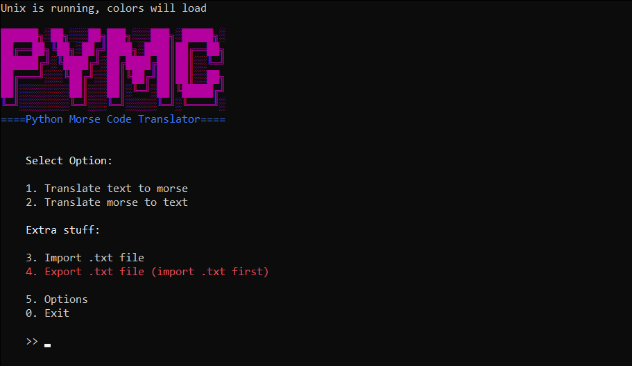

***██████╗░██╗░░░██╗███╗░░░███╗░█████╗░\
██╔══██╗╚██╗░██╔╝████╗░████║██╔══██╗\
██████╔╝░╚████╔╝░██╔████╔██║██║░░╚═╝\
██╔═══╝░░░╚██╔╝░░██║╚██╔╝██║██║░░██╗\
██║░░░░░░░░██║░░░██║░╚═╝░██║╚█████╔╝\
╚═╝░░░░░░░░╚═╝░░░╚═╝░░░░░╚═╝░╚════╝░\
=========Python Morse Code Translator=========***

# Table of Contents
1. [Usage](#usage)
2. [About](#about)
3. [TODO List](#todo-list)

## Usage
To run the program, simply run :
```
git clone https://github.com/rtxdr/morse-code-translator
```
```
cd morse-code-translator
```
```
python main.py
```
Note : If you're using Windows Powershell or Windows' command prompt, you can be presented to an error saying that "python/git wasn't a recognized command", to fix it, i suggest you modify your PATH for the programs

## About
It's a simple (unfinished and obsolete) python program that translates and encodes morse code, it's usage is very simple.\
Once you run the program, you're presented to a menu with multiple options that are self explanatory.


I've removed the colors on Windows systems because they would cause errors in CMD aswell as Powershell, if you still wish to use the colors for some reason then you can force Unix mode in the settings menu. The only reason you'd use this is if you use an external terminal on Windows.
## TODO List
- Make the program work in the first place
- Add more settings
